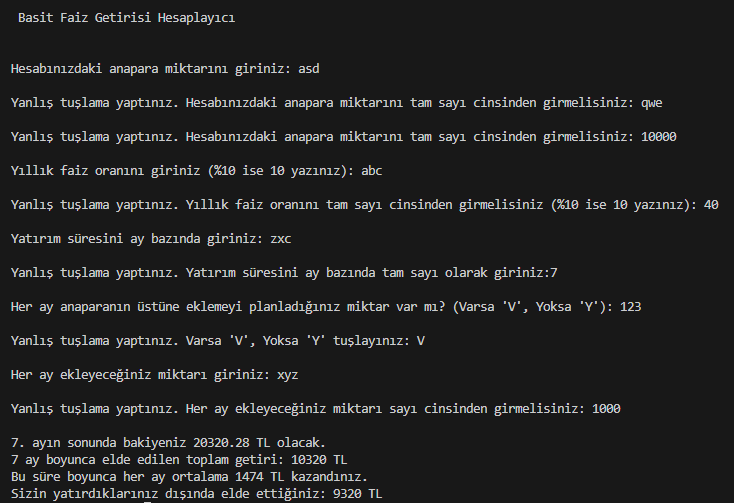

Geliştirici: Onur Canöz
Tarih: 7 Ocak 2026
Dil: Python

# Faiz Projeksiyon Aracı
Kullanıcının girdiği verilerle basit şekilde faiz getirisi hesaplayan Python uygulaması.
Yaptığım ilk proje. If-elif-else ve döngüler üzerinden yürütmeye çalıştım. 
Eklenecekler kısmındakiler ve mevcut kısıtlamaların düzeltilmiş hali programın yeni versiyonunda olacaklar. 

# Özellikler:
- Anaparaya her ay düzenli olarak eklediğiniz tutarları da istediğiniz süre sonunda hesaplamanızı sağlar.
- %100 üzerindeki faiz oranlarında kullanıcıdan onay alır, kullanıcı fark etmeden fazla tuşlama yaptıysa veriyi tekrar girebilir.
- Sayı yerine harf veya işaret koyulduğunda program error vermez, tekrar yazma imkanı sunar.

# Mevcut Kısıtlamalar
- Şu an sadece tam sayılar (Integer) girilebilir, küsüratlı (Float) girilmesine izin vermiyor.
- Ödemelerin yapıldığı spesifik günleri takip edemez, her 30 günü bir ay sayar.
- Yatırım süreci içindeki faiz değişimlerini hesaplayamaz.

# Eklenecekler
- Yatırımın 1, 3, 6 ve 12. aylar sonundaki durumunu toplu bir liste olarak gösterme özelliği eklenecek. 
- Türkçe metinlerde iyileştirme yapılacak, varsa dil bilgisi hataları düzeltilecek.

# Uzun Vadeli Hedefler
- Görsel arayüz eklenecek 
- "Ne kadar param olur?" sorusunun dışında "Hedeflediğim paraya ne kadar sürede ulaşırım?" sorusunu da cevaplayabilir hale gelecek.

